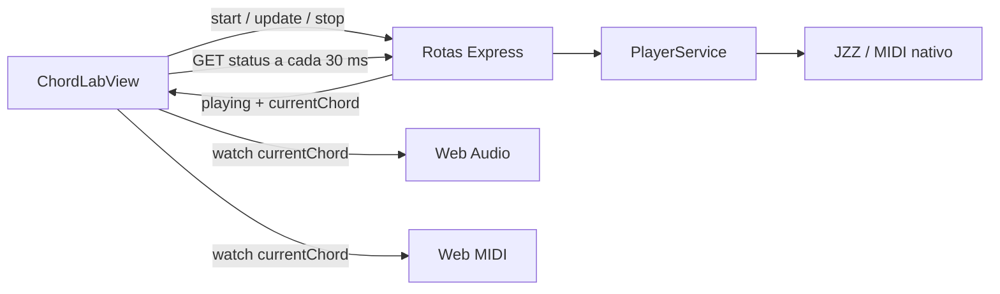

# MIDI Toolbox — análise e plano de melhorias

Data: 30/09/2026. Base analisada: commit `2d58ee3`.

> **Atualização após autorização de implementação:** o diagnóstico abaixo foi preservado como registro do estado original. As referências a arquivos antigos e os resultados de falha correspondem ao commit acima. As correções, a nova estrutura e todas as funcionalidades propostas na seção 9 foram implementadas; veja [IMPLEMENTACAO.md](IMPLEMENTACAO.md) para decisões, validação e limites, e [README.md](README.md) para uso e operação.

O principal investimento deve ser tornar a reprodução musical confiável e centralizar suas regras. A aplicação compila, mas existem falhas reproduzíveis que a tipagem atual não identifica: acordes com notas inválidas, entradas que travam ou encerram o servidor, reprodução local que não repete e notas que continuam agendadas depois de Stop. Essas correções devem preceder a expansão de funcionalidades.

Este documento descreve o diagnóstico e um plano executável. O código funcional não foi alterado nesta análise.

## 1. Escopo e evidências

Foram examinados todos os arquivos de código do cliente e do servidor, estilos, configuração de build, dependências declaradas, README e metadados dos assets. Foram executados:

- `npm run build`: cliente e servidor passaram.
- `npm ls --depth=0`: inventário das dependências instaladas.
- Reproduções de domínio com as funções reais compiladas.
- Chamadas HTTP contra uma instância local isolada; entradas que encerram/travam o processo foram reproduzidas também em subprocessos descartáveis.
- Navegação automatizada em Chromium, com reprodução Web Audio e instrumentação de criação/agendamento de fontes sonoras.
- Inspeção de layout nas larguras 320, 390, 768, 1024 e 1440 px, nas duas telas.
- Simulações de saída MIDI para registrar mensagens e verificar o ciclo de vida das notas.

Ambiente de execução: Node `24.18.0`, npm `11.16.0`. O README declara Node 20 ou superior; a compatibilidade com todas essas versões não foi testada. Não há scripts de testes, lint ou pipeline de CI versionados no estado analisado.

**Limites:** não havia saída MIDI nativa disponível. Não foram realizados testes auditivos em hardware, medições de latência física, validação em Safari/Firefox ou ensaios prolongados de memória. Mensagens MIDI simuladas comprovam o comportamento do código, mas não a resposta de cada sintetizador. Não foi feita auditoria de vulnerabilidades ou licenças de terceiros.

Os achados indicam seu nível de evidência:

- **Reproduzido:** observado executando o código ou a interface.
- **Inspeção:** caminho identificado no código, sem reprodução completa da consequência.
- **A validar:** comportamento dependente de hardware, concorrência ou condição ambiental ainda não ensaiada.

Como o escopo é produzir um plano, as etapas de implementação das correções e criação de uma suíte permanente ficam para sua execução. Os experimentos desta análise não constituem essa suíte.

## 2. Arquitetura atual

| Área | Responsabilidade atual | Avaliação |
| --- | --- | --- |
| `server/src/core` | Notas, escalas, acordes, duração e melodia | Boa intenção de isolar regras puras; existem erros e duplicação com o cliente. |
| `server/src/application/player-service.ts` | Loop, andamento, notas ativas e controle MIDI | Ponto natural para organizar o transporte, mas depende de relógio real e mistura diferentes ciclos de vida. |
| `server/src/infrastructure/midi` | Integração JZZ | Já existe uma Interface `MidiOutput`; vale preservá-la e corrigir seu contrato. |
| `server/src/routes` | HTTP, validação, construção de sequência e comandos de reprodução | Validação incompleta e regras musicais dentro das rotas. |
| `client/src/api` | HTTP, áudio, MIDI, persistência e teoria musical | O nome esconde responsabilidades muito diferentes. |
| `client/src/views/ChordLabView.vue` | Edição, persistência, melodia, transporte, polling, drag-and-drop e apresentação | 973 linhas, incluindo estilos; a concentração de responsabilidades é mais relevante que o tamanho isolado. |
| `client/src/components/Layout.vue` | Estrutura visual, tema, áudio e menus | 563 linhas, incluindo estilos; candidatos claros a extração. |
| `PianoKey.vue` | Apresentação, entrada de ponteiro, voz local, HTTP e MIDI | Cada tecla conhece detalhes de múltiplas saídas. |

O fluxo do Chord Lab é especialmente importante:



O servidor é o relógio da progressão, mas o navegador tenta reconstruir os eventos sonoros a partir do índice do acorde. Esse índice não informa repetição, ciclo, instante musical nem revisão da sequência. A troca de transporte entre essas camadas explica vários bugs do documento.

### O que preservar

- Monorepo simples com npm workspaces e TypeScript em modo `strict`.
- Separação inicial entre domínio, aplicação e infraestrutura no servidor.
- Melodia determinística para uma mesma entrada e seed.
- Controle de andamento lido nas transições de acordes e identificação de execução por `loopRunId`.
- Suporte a Web Audio, Web MIDI e MIDI nativo, incluindo entrada e sustain no navegador.
- Assets de piano locais, tokens CSS para temas e rotas de API desconhecidas retornando JSON 404.
- Preferências já persistidas e medidas existentes para suavizar envelopes de áudio.

## 3. Prioridades

| Prioridade | Significado | Aplicação |
| --- | --- | --- |
| P0 | Indisponibilidade do processo | Entradas que travam ou encerram o servidor. |
| P1 | Função principal incorreta ou controle de reprodução comprometido | Acordes inválidos, Stop incompleto, loop sem repetição, notas sem liberação. |
| P2 | Usabilidade, consistência, manutenção e evolução próxima | Persistência, feedback, layout, contratos, fluxo de trabalho. |
| P3 | Expansão após estabilização | Recursos avançados e otimizações sem gargalo demonstrado. |

Os tamanhos sugeridos no roadmap são relativos: **P** = ajuste localizado; **M** = mudança em alguns módulos com testes; **G** = alteração de fluxo entre cliente, servidor e saídas. Não são estimativas de prazo.

## 4. Bugs de lógica e reprodução

### B01 — acordes `maj7` contêm uma nota inválida — P1

**Evidência: reproduzido no domínio.**

Locais: [scale.ts](server/src/core/scale.ts), linhas 19–45; [chord.ts](server/src/core/chord.ts), linhas 15–20; [chord-builder.ts](client/src/api/chord-builder.ts), linhas 19–33; [melody.ts do cliente](client/src/api/melody.ts), linhas 93–99.

A escala cromática usada como tabela de semitons possui apenas 11 posições. O acorde `maj7` acessa a posição 11, que não existe. Para C4 maior com sétima maior:

```text
Atual:    [60, 64, 67, undefined]
Esperado: [60, 64, 67, 71]
```

O defeito está repetido nas três construções de acordes. A geração de melodia pode omitir essa nota, e as saídas recebem dados inválidos; a reação final depende da saída.

**Correção:** construir acordes diretamente com `rootMidi + intervalo`. Centralizar a implementação e validar que todas as notas sejam inteiras entre 0 e 127. Não corrigir apenas uma das cópias.

**Aceite:** testar as 12 tônicas, registros suportados, qualidades maior/menor e extensões disponíveis; nenhum resultado pode conter `undefined`, `NaN` ou nota fora do intervalo MIDI. Cliente e servidor devem consumir o mesmo resultado.

### B02 — BPM inválido pode travar o servidor — P0

**Evidência: reproduzido por HTTP em processo isolado.**

Locais: [chord-lab.ts](server/src/routes/chord-lab.ts), linhas 106–110 e 148–149; [timing.ts](server/src/core/timing.ts); [player-service.ts](server/src/application/player-service.ts), `loopSequence` e `waitUntil`.

`POST /api/chord-lab/start-progression` com um acorde válido e `bpm: -120` retornou 200. A chamada seguinte a `/status` excedeu o timeout. Os prazos negativos fazem o loop avançar por Promises já resolvidas sem devolver tempo útil ao processamento das próximas requisições.

O slider limitar a entrada não protege a API. O valor zero também possui uma semântica especial de 100 segundos, incompatível com a interface de 20–240 BPM.

**Correção:** validar tipo, finitude e intervalo de BPM tanto em start quanto em update; manter a mesma invariável no transporte. Definir explicitamente se BPM fracionário é suportado. Remover o sentinel como tratamento de dado inválido.

**Aceite:** valores negativos, zero, `null`, strings e valores fora do intervalo retornam 400; o estado anterior permanece intacto e `/status` continua respondendo. O teste de travamento deve rodar em subprocesso com encerramento garantido.

### B03 — uma tupla de acorde inválida encerra o processo — P0

**Evidência: reproduzido por HTTP.**

Local: [chord-lab.ts](server/src/routes/chord-lab.ts), `buildSequence` e rota `start-progression`.

O payload `{"chords":[null],"bpm":120}` passou pela validação superficial do array e gerou `TypeError: object null is not iterable`. Na execução analisada, a conexão foi encerrada e o processo saiu com código 1.

A rota é `async`, sem encaminhamento explícito da rejeição para o middleware de erro. A implementação instalada do Express 4 captura throws síncronos, mas não consome a Promise retornada pelo handler. Além disso, `player.loopSequence(...)` inicia uma tarefa assíncrona sem observar suas falhas posteriores.

**Correção:** validar todos os campos e limites antes de alterar estado; envolver handlers assíncronos em um mecanismo que encaminhe rejeições; supervisionar o loop iniciado em segundo plano. Aumentar validação não substitui tratamento de erros inesperados.

**Aceite:** `chords: [null]`, tuplas incompletas, notas/oitavas inválidas e flags com tipos errados retornam 400. Erros inesperados retornam 500 estruturado, liberam recursos necessários e não encerram o servidor.

### B04 — um loop de um único acorde toca apenas uma vez no navegador — P1

**Evidência: reproduzido em Chromium com Web Audio instrumentado.**

Local: [ChordLabView.vue](client/src/views/ChordLabView.vue), linhas 317–349; `/status` em [chord-lab.ts](server/src/routes/chord-lab.ts).

Com um acorde e 240 BPM, em aproximadamente 1,7 segundo houve 56 consultas de status, mas apenas três fontes sonoras criadas: a tríade inicial. O servidor continuava com `playing: true` e `currentChord: 0`.

O `watch(currentChord)` não é executado novamente quando o índice continua zero. O mesmo gatilho controla Web MIDI. Usar somente um índice também permite perder voltas inteiras quando consultas atrasam.

**Correção imediata:** comunicar um contador monotônico de passos ou eventos, associado à execução. **Correção estrutural:** agendar eventos musicais em um transporte independente da UI, conforme a seção 6. Não tratar um contador isolado como solução de precisão temporal.

**Aceite:** sequências com um e vários acordes repetem por pelo menos três voltas em todas as saídas; duas ocorrências do mesmo índice são eventos distintos.

### B05 — Stop não cancela vozes Web Audio já agendadas — P1

**Evidência: reproduzido por instrumentação das fontes Web Audio.**

Locais: [ChordLabView.vue](client/src/views/ChordLabView.vue), `handleStop` e `watch(running)`; [audio.ts](client/src/api/audio.ts), `playChordWithMelody`, `scheduleVoice` e `scheduleSynthTone`.

Com 20 BPM, quatro notas de melodia e som 8-bit, Stop foi acionado por volta de 0,24 s. Permaneceram fontes com inícios agendados para aproximadamente 1,56 s, 3,06 s e 4,56 s, e término da harmonia próximo de 6,08 s. Nenhum cancelamento adicional foi enviado a essas fontes.

O Stop espera primeiro a resposta HTTP e só limpa Web MIDI. Não existe um registro cancelável de vozes do sequenciador Web Audio.

**Correção:** atribuir as vozes a uma execução; cancelar imediatamente os eventos locais e aplicar uma liberação curta nas vozes ativas; solicitar a parada remota com tratamento de erro separado. Invalidar callbacks assíncronos de execuções canceladas.

**Aceite:** depois de Stop não começa nenhuma nova nota daquela execução, mesmo com melodia agendada, sample carregando ou servidor indisponível. Definir separadamente a cauda de release/reverb permitida e o comportamento de um comando Panic.

### B06 — navegação deixa o transporte remoto órfão — P1

**Evidência: reproduzido no navegador e na API.**

Local: [ChordLabView.vue](client/src/views/ChordLabView.vue), linhas 177–178 e 266–270.

Passos: iniciar uma progressão, navegar para Piano e voltar ao Chord Lab. O servidor permanece tocando; a tela volta com “Ready” e Stop desabilitado. O cleanup remove polling e reprodução Web MIDI, mas não encerra nem reassocia a execução remota.

**Correção recomendada:** manter o transporte no nível da aplicação, com controles disponíveis nas duas telas. Montar uma view não deve criar outra verdade sobre o estado da execução. Se o produto optar por interromper ao sair, implementar essa política nas três saídas e comunicar o resultado.

**Aceite:** navegar entre telas nunca perde o controle da execução ativa. Recarregar a página deve reconciliar o estado remoto, com uma regra definida para retomada ou encerramento.

### B07 — soltar uma tecla antes do sample carregar perde o release — P1

**Evidência: reproduzido com o carregamento dos WAVs controlado no navegador.**

Local: [audio.ts](client/src/api/audio.ts), linhas 320–331 e 354–369.

`releaseTone` marca `releaseApplied = true` mesmo quando os arrays de fontes e ganhos ainda estão vazios. Quando o sample fica disponível, o replay de release encontra essa flag e retorna sem aplicar a liberação.

No ensaio de pressionar/soltar C4 antes da liberação do download, a voz criada posteriormente recebeu apenas seu stop natural, em aproximadamente 4,09 s; não recebeu o stop do envelope de release.

**Correção:** representar o estado da voz (`loading`, `active`, `released`, `stopped`) e aplicar a intenção pendente quando a fonte existir. Distinguir “release solicitado” de “release aplicado”.

**Aceite:** note-off antes, durante e depois do carregamento produz a mesma política musical de liberação; Stop antes do carregamento impede ataque tardio.

### B08 — o piano virtual tem duração diferente na saída nativa — P1

**Evidência: inspeção; efeito auditivo em dispositivo nativo a validar.**

Locais: [PianoKey.vue](client/src/components/PianoKey.vue), linhas 81–95; [play.ts](server/src/routes/play.ts); [player-service.ts](server/src/application/player-service.ts), `playSequence`.

Web Audio e Web MIDI recebem eventos de pressionar/soltar. A saída nativa recebe `/play`, que toca uma nota com duração fixa. Com a configuração padrão, a nota fica ativa por 0,75 s, independentemente de quanto tempo a tecla foi segurada; a requisição termina após o intervalo completo de 1,5 s.

**Correção:** oferecer comandos explícitos de note-on/note-off com identidade de sessão/origem. Manter “tocar por uma duração” como uma operação diferente. Fazer `PianoKey` emitir intenções para um módulo de performance, sem conhecer HTTP ou a saída escolhida.

**Aceite:** segurar por dois segundos e soltar rapidamente têm comportamento equivalente nas três saídas, respeitadas as características do timbre.

### B09 — liberação de notas sobrepostas diverge entre as saídas — P1

**Evidência: sequência de mensagens reproduzida com um Adapter MIDI de teste; resposta de hardware a validar.**

Locais: [player-service.ts](server/src/application/player-service.ts), linhas 67–90; [midi.ts](client/src/api/midi.ts), `sendBrowserNoteOn` e `sendBrowserNoteOff`.

Quando harmonia e melodia usam simultaneamente a nota 60, o servidor emitiu `on 60`, `on 60`, `off 60` antes do término da harmonia. Tokens identificam tarefas, mas a mensagem MIDI continua endereçando a mesma nota no mesmo canal. Um sintetizador pode interromper a nota sustentada.

No navegador existe contagem por pitch que adia note-off até o último dono, mas os ataques continuam duplicados. As políticas são diferentes e precisam ser deliberadas.

**Correção:** modelar posse por execução/origem, canal e nota; definir se notas iguais compartilham voz ou pertencem a canais separados. Para harmonia e melodia independentes, canais configuráveis oferecem uma separação útil, desde que compatível com o instrumento.

**Aceite:** testes de mensagens verificam a política escolhida para harmonia + melodia + entrada manual. Validar depois em um sintetizador real.

### B10 — desmontar uma tecla pressionada não envia note-off Web MIDI — P1

**Evidência: reproduzido com saída Web MIDI simulada.**

Local: [PianoKey.vue](client/src/components/PianoKey.vue), linhas 63–68.

Ao pressionar uma tecla e navegar programaticamente para outra rota antes do mouseup, foi emitido somente `[144, 60, 20]`; não houve mensagem note-off. O cleanup para a voz local, mas não libera a nota externa. Também faltam caminhos explícitos de `touchcancel`/`pointercancel` e perda de foco.

**Correção:** usar Pointer Events e captura de ponteiro, manter o identificador da voz iniciada e executar uma liberação idempotente em todos os caminhos de término. A liberação deve usar a saída de origem, inclusive se a seleção mudar durante o toque.

**Aceite:** pointerup, cancelamento, desmontagem e perda de foco não deixam notas pertencentes à tecla ativas; testar com mensagens registradas e depois com dispositivo.

### B11 — a função genérica de escalas está incorreta — P2

**Evidência: reproduzido no domínio; caminho maior/menor dessa função não é o gerador atual de melodia.**

Local: [scale.ts](server/src/core/scale.ts), `getScaleNotes`.

`getScaleNotes('major', 1, 4)` retorna `[61, 63, 64, 66, 68, 70]`, em vez de `[60, 62, 64, 65, 67, 69, 71]`. O cálculo depende de uma origem ajustada para passos cromáticos e não inclui corretamente a tônica.

**Correção:** representar escalas por offsets em relação à tônica, como já acontece em parte do código de melodia. Definir a semântica de `includeOctave` e de registros múltiplos. Não usar essa função para implementar novos recursos antes de corrigi-la.

**Aceite:** escala maior tem sete classes de altura; cromática tem doze; incluir a oitava acrescenta a tônica seguinte; registros não produzem notas fora dos limites.

### B12 — a persistência não preserva a melodia gerada — P2

**Evidência: reproduzido no navegador.**

Locais: [ChordLabView.vue](client/src/views/ChordLabView.vue), linhas 210 e 291–305; [settings.ts](client/src/api/settings.ts).

Os acordes e restrições são salvos, mas a seed não. Duas aberturas do mesmo estado produziram seeds `425580990` e `1449310019`. A geração continua determinística para cada seed, mas a ideia musical não é restaurada integralmente.

**Melhoria:** persistir seed e versão do algoritmo. Quando houver edição manual da melodia, salvar também as notas resultantes e indicar se estão vinculadas ao gerador.

**Aceite:** salvar/reabrir ou navegar preserva as notas; somente “Generate” ou mudanças que explicitamente regeneram a ideia alteram a seed.

### B13 — validação e tratamento de erros são inconsistentes — P2

**Evidência: reproduções HTTP e inspeção.**

- `/play` aceitou `keyNum: 60.5` com 200: falta validar inteiro.
- A progressão aceitou a tupla `[99, 99, 0, 0, false]` com 200: faltam limites dos campos e validação do resultado musical.
- JSON malformado retornou 500 com “Internal server error”, embora seja um erro de entrada. O middleware final ignora o status original do parser.
- `readStoredSettings` faz cast de qualquer objeto; `isStoredChord` verifica formato e inteiros, mas não os intervalos dos campos.
- `storedNumber` limita o intervalo, mas não normaliza inteiros para campos discretos.
- `localStorage.setItem` não está protegido contra falhas de gravação. O tema é mantido em duas chaves diferentes.

**Correção:** contratos de validação reutilizados pela API e restauração do estado, erros com código e campos, migrações de schema e gravação tolerante a falhas. Limitar quantidade de acordes e tamanho de projeto com critérios explícitos.

**Aceite:** entradas inválidas não chegam ao domínio; falhar ao salvar não interrompe a reprodução; a UI informa quando uma alteração ainda não foi persistida.

## 5. UI, acessibilidade e estados de interação

| ID / prioridade | Evidência e problema | Mudança proposta | Critério de aceite |
| --- | --- | --- | --- |
| U01 / P2 | **Reproduzido:** em 320 px, o documento mede 352 px nas duas rotas; o cabeçalho ultrapassa a viewport. | Reorganizar os controles globais em uma grade ou painel compacto; permitir redução/quebra dos grupos. | Sem rolagem horizontal da página em 320 px; o teclado pode manter sua própria rolagem horizontal. |
| U02 / P1 | **Reproduzido:** focar C4 e pressionar Enter cria zero vozes; clicar cria uma. `PianoKey` só escuta mouse e touch. | Implementar acionamento por teclado com keydown/keyup, prevenção de repetição indevida e liberação em blur. | Piano operável sem mouse; Enter/Espaço têm uma política consistente e não duplicam ataques por eventos sintetizados. |
| U03 / P2 | **Inspeção:** selects de nota/oitava/qualidade não têm labels; botões `+` e `x` não descrevem a ação. | Nomes acessíveis por acorde, `aria-pressed` no mute, identificação da posição e nome descritivo nas ações. | Leitor de tela distingue cada campo e anuncia o estado de mute. |
| U04 / P2 | **Inspeção:** reordenação depende de drag-and-drop; não há alternativa por teclado nem implementação explícita para toque. | Adicionar mover anterior/próximo e alça dedicada; preservar foco usando IDs estáveis. | Reordenar por teclado, mouse e toque produz a mesma sequência sem perder foco. |
| U05 / P2 | **Reproduzido:** Escape não fecha o menu de temas. Menus declaram `role=menu`, sem navegação de foco correspondente. | Implementar foco, Escape, retorno ao acionador e semântica adequada; considerar um popover simples se não for implementar um menu completo. | Abertura, seleção e fechamento possíveis por teclado; apenas o menu pretendido fica aberto. |
| U06 / P2 | **Inspeção:** checkbox visualmente oculto recebe foco, mas o desenho do toggle não tem indicador próprio. | Aplicar estado de foco ao controle visível com `:focus-visible`/`:focus-within`. | O usuário consegue localizar o foco nos toggles de harmonia e melodia. |
| U07 / P2 | **Inspeção:** Start não tem estado `starting`; falhas de start/stop ficam apenas no console; erros de polling/update são descartados. | Estados explícitos de transporte e feedback com recuperação; impedir comandos concorrentes incompatíveis. | Cliques rápidos não iniciam duas execuções; falha de rede aparece na tela e o áudio local pode ser parado. |
| U08 / P2 | **Inspeção:** `PortSelector` ignora `error` de `/ports`; falha de Web MIDI pode sumir quando a consulta ao servidor tem sucesso. | Mostrar disponibilidade e falhas separadas de áudio local, MIDI do navegador e MIDI nativo. | “Nenhum dispositivo”, “sem permissão”, “não suportado” e “servidor indisponível” são distinguíveis. |
| U09 / P2 | **Inspeção:** Play pode iniciar sem áudio local e sem saída MIDI, com todos os acordes mutados ou apenas melodia com zero notas. | Calcular se há material audível e saída disponível; explicar estados silenciosos, permitindo reprodução silenciosa se for uma escolha do usuário. | O botão e o status explicam por que a reprodução não produz som. |
| U10 / P2 | **Inspeção:** “Melody active” pode coexistir com zero notas; KEY não afeta `Chord tones`; remover o último acorde parece possível, mas não faz nada. | Ajustar indicadores, desabilitar campos sem efeito e explicar limites. Usar escolha exclusiva para as sétimas. | Cada controle produz efeito observável ou explica por que está indisponível. |

### Melhorias de apresentação

- Em 768 px não houve transbordamento da página, mas os dois painéis ficam estreitos e muito altos. Antecipar a coluna única ou usar um breakpoint guiado pela largura mínima útil do conteúdo.
- Tornar controles de transporte alcançáveis em progressões longas e em ambas as telas.
- Mostrar nome e oitava da nota tocada e referências de C no teclado; hoje os nomes estão apenas em tooltip/atributo acessível.
- Reduzir a dependência de textos muito pequenos e de diferenças de cor para indicar estado. Medir contraste por tema antes de declarar conformidade.
- Usar tokens semânticos para cores ainda fixas, como estados ativos e fundos do painel de melodia. Testar a legibilidade nos sete temas.
- Respeitar preferência de redução de movimento nas animações de flash e deslocamento.
- Adotar PT-BR e inglês como opção de produto, caso o público justifique; separar mensagens do conteúdo estrutural facilita essa evolução.

## 6. Estrutura proposta para facilitar novas implementações

### 6.1 Organizar por responsabilidade e capacidade

Não é necessário trocar Vue, Express ou os workspaces. A proposta é extrair módulos com Interfaces pequenas, concentrando regras que hoje precisam ser conhecidas por várias telas e saídas.

```text
packages/
  music-core/
    src/                    # Notas, acordes, escalas, melodia, tempo e compilação
  contracts/
    src/                    # Comandos, snapshots, schema de projeto e validação
client/src/
  app/                      # Bootstrap, router e composição das dependências
  features/
    piano/                  # Interações de performance e apresentação do piano
    chord-lab/              # Edição de progressão, controles e operações do editor
  playback/                 # Transporte do navegador e estado da execução
  audio/                    # Vozes, instrumentos, efeitos e carregamento de samples
  midi/                     # Entrada, saída, dispositivos e política de notas
  infrastructure/
    http/                   # Comunicação com servidor e normalização de erros
    persistence/            # Leitura, migração e gravação de projetos/preferências
  ui/                       # Controles visuais realmente reutilizados e temas
server/src/
  app.ts                    # Construção do Express sem abrir porta nem hardware
  index.ts                  # Configuração, bootstrap e encerramento
  application/              # Casos de uso de transporte e dispositivos
  ports/                    # Interfaces das dependências externas
  infrastructure/
    midi/                   # Adapter JZZ
    timing/                 # Relógio e agendamento do servidor
  routes/                   # Validação HTTP e encaminhamento dos comandos
```

`music-core` deve ser puro: sem Vue, DOM, Express, JZZ ou armazenamento. `contracts` pode começar como uma pasta de um único pacote compartilhado; criar dois pacotes só se houver vantagem concreta de dependências/build. Definir exports e ordem de compilação dos workspaces, sem imports diretos do cliente para arquivos internos do servidor.

### 6.2 Substituir tuplas opacas por um modelo explícito

Hoje `[1, 4, 1, 2, false]` depende de convenções espalhadas. `ChordData` ainda é exportado de um arquivo `.vue`, fazendo lógica musical depender de um artefato de apresentação.

Um modelo inicial possível:

```ts
type ChordSpec = {
  id: string;
  rootPitchClass: number; // inteiro 0–11, validado na entrada
  octave: number;
  quality: 'major' | 'minor';
  seventh: 'none' | 'major' | 'minor';
  muted: boolean;
  durationBeats: number;
};

type NoteEvent = {
  id: string;
  trackId: string;
  note: number;
  startBeat: number;
  durationBeats: number;
  velocity: number;
  channel: number;
};
```

Esses tipos ilustram o contrato, não substituem validação em runtime. Não adicionar desde já campos para todas as features futuras.

- Converter o `noteKey` legado de 1–12 para a convenção escolhida em um único ponto de migração.
- Usar `id` como chave do Vue, identidade de seleção, referência do playhead e alvo de reordenação.
- Separar andamento, duração em beats, compasso e gate. `timeSignature: 0.5` hoje é usado como divisor de duração, não representa explicitamente um compasso.
- Salvar versão do schema e do gerador. Preservar a duração atual de dois beats por acorde durante a migração.
- Não interpretar “mute do acorde” automaticamente como mute da melodia: essa regra precisa ser nomeada no modelo e refletida na UI.

### 6.3 Concentrar comportamento em módulos com Interfaces pequenas

| Módulo | Interface sugerida | Complexidade que deve esconder |
| --- | --- | --- |
| Compilação musical | `compileProject(project): CompiledSequence` | Acordes, melodia determinística, durações, eventos e validação musical final. |
| Transporte | `start`, `update`, `stop`, `subscribe` | Identidade da execução, relógio, transições, versões, cancelamento e reconciliação. |
| Performance ao vivo | `press`, `release`, `releaseAll` | Posse das notas, roteamento e consistência entre mouse, teclado e MIDI IN. |
| Dispositivos | `list`, `select`, `subscribe` | Permissões, conexão, troca de saída, falhas e reconexão. |
| Projetos | `load`, `save`, `export`, `import` | Schema, migrações, autosave, defaults e falha de armazenamento. |

Uma **Seam** útil já existe entre reprodução e saída: há três **Adapters** reais, Web Audio, Web MIDI e JZZ. Relógio/agendador também merece uma Seam para permitir testes determinísticos. Evitar Interfaces genéricas para tudo ou classes que apenas repassam chamadas sem esconder complexidade.

Detalhes importantes na migração:

- Mover `MidiOutput` para a camada que consome o contrato. `openPort` está declarado como `void`, embora o Adapter implemente `Promise<void>`; a Interface deve comunicar a conclusão assíncrona.
- Separar enumeração/seleção de dispositivos de emissão de notas, se os consumidores de fato precisarem dessas capacidades separadamente.
- Rotas devem depender de contratos de aplicação, não do `JzzAdapter` concreto. Remover a dependência `midi` não utilizada em `chordLabRouter`.
- `ChordLabView` deve compor editor, painel de melodia e transporte; watchers de rede e agendamento devem sair da view.
- `PianoKey` deve emitir intenção e renderizar estado. Subscrever à entrada MIDI uma vez no módulo de performance evita 88 listeners de negócio independentes.
- Extrair seletores de tema/som do Layout; compartilhar primitivas visuais quando houver repetição real.
- Revisar APIs de compatibilidade e campos sem uso, como `loopTimeout`, após mapear seus consumidores.

### 6.4 Definir uma política de transporte por execução

**Direção recomendada:** o navegador controla o agendamento de Web Audio e Web MIDI; o servidor controla o agendamento JZZ. Ambos consomem a mesma sequência musical compilada. Para reprodução simultânea local + nativa, usar uma execução coordenada com instante de início futuro e sincronização dos relógios.

Isso evita depender de um GET HTTP para disparar cada acorde local e permite usar as saídas do navegador sem exigir um servidor musical ativo, depois que o cliente estiver carregado.

O contrato precisa incluir pelo menos:

- `runId` para impedir efeitos de uma execução encerrada.
- `revision` para ordenar alterações do projeto durante a reprodução.
- `stepId`/contador de eventos e posição musical, além do índice visual do acorde.
- Início programado, andamento e política de aplicação de updates na próxima transição.
- Estados `idle`, `starting`, `playing`, `stopping`, `error`.

**Agendamento:** usar um relógio monotônico; no navegador, traduzir posições musicais para o tempo do AudioContext e timestamps da saída MIDI. Agendar uma janela curta à frente, mantendo cancelamento. O servidor deve usar relógio monotônico e uma política explícita para eventos atrasados. Definir o comportamento quando a aba fica oculta ou o AudioContext é suspenso.

**Sincronização remota:** SSE pode servir para snapshots/eventos do servidor mantendo comandos em HTTP. WebSocket só deve ser introduzido quando a comunicação bidirecional ou a entrada ao vivo justificar. Trocar polling por socket, sozinho, não resolve sincronização musical.

**Concorrência:** o servidor atual contém um único player global. Inicialmente, declarar a sessão como exclusiva e impedir que duas abas assumam silenciosamente a mesma saída. Multiusuário completo deve ser uma decisão de produto posterior.

## 7. Áudio e MIDI: ajustes adicionais

| Tema | Estado observado | Proposta |
| --- | --- | --- |
| Duração dos samples | `scheduleVoice` recebe duração, mas o caminho piano inicia um sample sem usar esse valor; o 8-bit usa a duração. | Definir gate e release por instrumento; permitir cauda natural sem ignorar Stop nem a articulação da melodia. |
| Falha de sample | Falha é armazenada como Promise resolvida com `null`; tocar altera o modo global para `none`, sem erro na UI. | Estado de carregamento por sample, retry explícito e aviso; não transformar indisponibilidade transitória em preferência permanente. |
| Gestão de vozes | Fontes temporizadas do sequenciador não têm dono nem operação de cancelamento. | Registro por execução/origem, cleanup em `onended`, desconexão de nós e limite de polifonia definido. Medir memória antes de afirmar vazamento. |
| Sustain e canais | Entrada descarta o nibble de canal e indexa vozes apenas por nota; sustain é global. | Preservar canal no evento normalizado e oferecer filtro de entrada. Validar combinações multicanais. |
| Troca de dispositivo | Envolve estado local e duas chamadas remotas; selects permitem novas trocas durante operações anteriores. | Operação serializada/versionada, estado de conexão confirmado e política de rollback; liberar notas na saída anterior. |
| Detecção de dispositivos | JZZ relê `engine.info()`; não há ciclo explícito de observação/reconexão nativa. | Testar hot-plug real antes de alterar o Adapter; exibir a diferença entre preferência salva e dispositivo conectado. |
| Emergência | Não há Panic global. | Cancelar agendamentos, liberar notas da aplicação e enviar mensagens de reset apropriadas aos canais controlados. Diferenciar Stop musical de silenciamento de emergência. |

## 8. Performance, manutenção e operação

### Performance com base no que foi observado

- **Polling:** 30 ms equivale a aproximadamente 33 consultas/s por aba durante a reprodução. Foram observadas 56 em 1,7 s. Retirar o áudio desse ciclo; depois ajustar frequência dos snapshots ou usar eventos.
- **Geração repetida:** o watcher do acorde recompõe a melodia de toda a progressão; com MIDI habilitado, pode fazê-lo duas vezes por transição. Compilar/cachear por revisão do projeto e seed, compartilhando o resultado entre saídas.
- **Persistência:** o watcher profundo serializa o estado durante edição de sliders. Usar autosave com debounce, indicador de gravação e flush nos pontos apropriados.
- **Samples:** o build inclui oito WAVs de cerca de 352,84 kB cada, aproximadamente 2,82 MB no total. O piano padrão aquece todos os registros. Expor carregamento e medir startup em rede lenta antes de decidir entre preload completo e por região.
- **Bundle:** nesta execução, JS principal de 129,91 kB, 49,23 kB gzip; CSS de 26,48 kB, 5,54 kB gzip. O tamanho atual não justifica uma reescrita ou microfrontends. Lazy loading das rotas pode ser considerado conforme o app crescer.

### Qualidade e operação

- Criar scripts `typecheck`, `lint`, `test` e `test:e2e`, com verificações proporcionais ao risco. Usar formatação consistente; hoje aspas, recuo e estilo variam entre arquivos.
- Habilitar `noUncheckedIndexedAccess` primeiro no domínio compartilhado. Isso ajuda a revelar acessos como `scale[11]`; tratar os casos corretamente, sem espalhar non-null assertions.
- Construir `createApp(dependencies)` separadamente do bootstrap para testar HTTP com um Adapter MIDI controlado e sem carregar hardware.
- Encerrar loops, notas, porta MIDI e servidor em shutdown controlado. O bootstrap atual não possui esse ciclo explícito.
- Tornar `HOST` e `PORT` configurações validadas. `app.listen(PORT)` não restringe o bind a localhost; para o uso local descrito no README, adotar loopback por padrão e tornar acesso em rede uma escolha explícita.
- Adicionar healthcheck sem efeito colateral, códigos de erro estáveis e logs úteis com `runId`, dispositivo e revisão. Não registrar cada consulta de status como evento de negócio.
- Remover `client/tsconfig.tsbuildinfo` do versionamento e ignorar artefatos de compilação incremental.
- Fixar a política de versão do Node em `engines` e em um arquivo de ferramenta adotado pelo projeto; validar essa versão no CI.
- Atualizar README com os recursos já existentes de MIDI IN, sustain, timbres, temas e persistência, além dos limites de sessão e comportamento do transporte.
- Revisar dependências com auditoria e testes antes de atualizações de major; este diagnóstico não afirma que uma versão instalada tenha vulnerabilidade específica.

## 9. Novas funcionalidades propostas

As prioridades abaixo são propostas de produto, não funcionalidades já implementadas. A ordem considera o fluxo atual de experimentar, compor e reutilizar uma ideia musical.

| Funcionalidade | Valor para o usuário | Dependência principal | Prioridade / tamanho | Entrega mínima verificável |
| --- | --- | --- | --- | --- |
| Projetos nomeados e importação/exportação JSON | Preservar várias ideias e transferi-las entre máquinas. | Schema versionado, persistência e seed salva. | P2 / M | Salvar, duplicar, abrir e importar com validação sem perder o projeto atual. |
| Desfazer/refazer | Editar e reordenar sem receio de perder a progressão. | IDs estáveis e operações explícitas do editor. | P2 / M | Undo/redo de adicionar, remover, editar e mover, sem incluir ticks do playhead no histórico. |
| Exportação `.mid` | Usar acordes e melodia em uma DAW. | Sequência compilada em eventos. | P2 / M | Arquivo contém tempo, durações, velocidades e trilhas identificadas; importar em uma DAW de teste. |
| Preview de acorde e identificação de notas | Conferir uma edição sem iniciar o loop completo. | Performance/áudio cancelável e domínio unificado. | P2 / P | Ouvir um acorde, visualizar suas notas e interromper o preview. |
| Inversões e transposição | Criar condução de vozes e adaptar a tonalidade. | Modelo explícito de acorde e limites de registro. | P2 / M | Inversões preservam classes de altura; transposição trata limites e desfazer. |
| Duração por acorde e seleção de trecho em loop | Criar frases com ritmo harmônico variado. | Modelo em beats e transporte confiável. | P2 / M | Acordes de 1, 2 e 4 beats e loop de um trecho obedecem ao andamento. |
| Metrônomo, contagem inicial e tap tempo | Facilitar execução e gravação. | Relógio do transporte. | P2 / M | Clique acompanha a mesma posição musical, sem relógio paralelo. |
| Presets de progressões | Acelerar experimentação. | Projetos/compilação musical. | P2 / P | Carregar preset com opção de preservar ou substituir o projeto atual. |
| Piano roll de melodia | Inspecionar e ajustar o que o gerador criou. | Eventos com IDs e estado da melodia persistido. | P3 / G | Editar altura/duração/velocity; decidir como futuras regenerações afetam edições. |
| Gravação de MIDI IN e quantização | Capturar ideias tocadas no instrumento. | Eventos de entrada normalizados e relógio comum. | P3 / G | Gravação preserva note-on/off, canal e velocity; quantização é reversível. |
| Canais, volumes por trilha e MIDI Thru opcional | Controlar melhor instrumentos externos e camadas. | Roteamento e política de posse de notas. | P3 / M | Rotas visíveis, prevenção de feedback e comportamento consistente de sustain. |
| Exportação de áudio | Compartilhar uma composição sem MIDI externo. | Renderer de eventos e instrumentos bem definidos. | P3 / G | Renderização offline produz duração correta e não inclui sons de outras execuções. |

Adiar marketplace de plugins, colaboração remota, autenticação e infraestrutura distribuída até existir demanda concreta. O estado atual pode evoluir bastante mantendo a aplicação local simples.

## 10. Testes que devem proteger a evolução

| Camada | Casos de maior valor | Como testar |
| --- | --- | --- |
| Domínio musical | B01/B11, todas as tônicas, intervalos MIDI, seed determinística, registro e durações. | Funções reais do pacote compartilhado, tabelas de casos e propriedades. |
| Contratos | Tuplas legadas, schema novo, BPM inválido, JSON malformado, excesso de acordes e storage corrompido. | Payloads válidos/inválidos e invariável de não alterar estado ao rejeitar. |
| Transporte | Uma/várias posições, Stop, restart rápido, edição ao vivo, eventos atrasados e revisões fora de ordem. | Relógio injetado e Adapter que registra eventos; sem sleeps reais na maior parte da suíte. |
| Áudio | Stop com eventos futuros; note-off antes do sample; falha/retry de download e troca de modo. | Lifecycle isolado mais ensaios em navegador real nos pontos que dependem de Web Audio. |
| MIDI | Notas sobrepostas, canais, sustain, troca de porta e Panic. | Sequências de mensagens registradas; smoke manual posterior em hardware. |
| HTTP | Processo sobrevive a entradas inválidas; erros assíncronos tratados; status e conflitos de sessão. | App construído com dependências de teste; subprocesso com timeout para regressões de travamento. |
| UI | Navegação durante playback, teclado, drag alternativo, erros, reconexão e restauração de projeto. | Fluxos completos em navegador, sem testar apenas se componentes montam. |
| Layout | 320/390/768/1024/1440 px, temas, menus abertos e nomes longos de dispositivos. | Assert de overflow, revisão visual e verificação de acessibilidade. |

O fluxo mínimo de CI deve instalar pelo lockfile, verificar tipos/lint, executar testes relevantes e compilar os dois workspaces. Adicionar smoke E2E dos fluxos essenciais. Evitar snapshots extensos de markup que apenas espelhem a implementação.

### Reproduções pequenas preservadas neste documento

Após `npm run build`, este comando detecta diretamente o defeito de `maj7` no estado analisado:

```bash
node --input-type=module <<'JS'
import assert from 'node:assert/strict';
import { getScaleNotes } from './server/dist/core/scale.js';
import { getChord } from './server/dist/core/chord.js';

assert.deepEqual(
  getChord(getScaleNotes('chromatic', 1, 4), 'major', 'maj7'),
  [60, 64, 67, 71],
);
JS
```

Resultado atual: falha de assert; a última posição é `undefined`. Após a centralização do domínio, adaptar o import à nova Interface pública.

Para o loop de um acorde: manter apenas um acorde no Chord Lab, escolher 8-bit, 240 BPM e Play; observar pelo menos três períodos de 500 ms. A execução deve produzir um novo ataque a cada período. Para navegação: iniciar, ir a Piano, voltar e comparar o status da tela com `GET /api/chord-lab/status`.

Os payloads de B02 e B03 devem ser ensaiados somente em processo descartável, pois o comportamento reproduzido impede uma parada normal pela API. Usar timeout e encerramento garantido no teste.

## 11. Roadmap de implementação

| Etapa | Escopo | Dependências | Tamanho | Saída necessária |
| --- | --- | --- | --- | --- |
| 1 — estabilizar entradas | B02, B03 e erros de entrada de B13; supervisão do loop. | Nenhuma refatoração ampla. | M | API rejeita dados inválidos sem travar, morrer ou modificar execução válida. |
| 2 — corrigir teoria musical | B01 e B11; extrair regras puras compartilhadas com testes. | Etapa 1 protege o uso via API. | M | Uma única construção de acordes/escalas e resultados válidos nas saídas. |
| 3 — recuperar controle de notas | B05, B07, B08, B09 e B10; Stop/Panic e ciclo de vida. | Contratos mínimos de vozes, notas e origem. | G | Toda nota tem dono e um caminho verificável de término. |
| 4 — organizar transporte | B04, B06, estados de comando, identificação/revisão de execução e agendamento. | Etapas 2 e 3. | G | Loop local independente de polling, navegação consistente e updates ordenados. |
| 5 — consolidar editor e persistência | Modelo com IDs, migração, B12/B13, extração da view e estado de projeto. | Domínio compartilhado. | M | Projeto reabre identicamente e operações do editor são testáveis fora da UI. |
| 6 — concluir usabilidade | U01–U10, feedback de dispositivos, teclado, foco e layout. | Estados de transporte e projeto disponíveis; U01/U02 podem começar antes. | M | Fluxos principais operáveis por teclado e em telas estreitas. |
| 7 — ampliar composição | Projetos, undo/redo, exportação MIDI, inversões e durações. | Etapas 2–6 conforme cada feature. | M/G | Entregas pequenas e independentes, cada uma com aceite de produto. |

### Backlog inicial — implementado

- [x] Rejeitar BPM e acordes inválidos em start/update sem alterar o estado anterior.
- [x] Tratar rejeições de handlers e da tarefa de reprodução; preservar status de erros do parser.
- [x] Corrigir `maj7` e escalas, extraindo a implementação musical compartilhada.
- [x] Tornar as vozes locais canceláveis e corrigir release durante carregamento.
- [x] Implementar note-on/off nativo e liberação idempotente das teclas em cancelamentos/desmontagem.
- [x] Definir política de sobreposição de notas e canais, com testes de mensagens.
- [x] Substituir o índice como gatilho sonoro por uma execução com eventos e relógio próprio.
- [x] Persistir/reconciliar o estado do transporte fora das views.
- [x] Migrar tuplas para objetos com IDs e salvar seed/schema do projeto.
- [x] Corrigir overflow em 320 px, acionamento por teclado e feedback de erro.
- [x] Adicionar a suíte essencial e CI; atualizar documentação operacional.
- [x] Entregar projetos nomeados, desfazer/refazer e exportação MIDI.

## 12. Critério de conclusão da estabilização

A base está pronta para receber features maiores quando entradas inválidas não derrubam o servidor; acordes e melodias são válidos e consistentes; loops de um acorde repetem; Stop cancela novos ataques; navegação não perde o transporte; notas são liberadas em todos os caminhos de término; projetos preservam a ideia musical; e os fluxos principais funcionam por teclado e nas larguras verificadas.

Esses resultados devem ser demonstrados por testes e uso real. Redistribuir arquivos, isoladamente, não encerra a refatoração.
